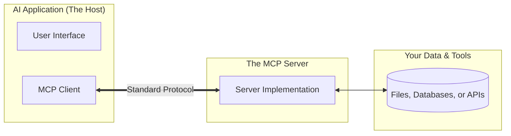

# Model Context Protocol (MCP)

## What is MCP?
The **Model Context Protocol (MCP)** is a standard way for AI applications to talk to the outside world. 

Think of it like a universal translator: 
- On one side, you have an **AI Assistant** (like Claude or a specialized coding tool).
- On the other side, you have **Data** (like your local files, a database, or a web service).

Instead of building a unique connection for every single tool, developers can use MCP to create one connection that works everywhere.

## How it Works
MCP uses a simple "Client-Server" setup to bridge the gap between AI and your data.

### The Key Players:
*   **The Host:** This is the app you are actually using (e.g., Claude Desktop, a code editor). It contains the **MCP Client**.
*   **The Server:** This is a small program that "knows" how to talk to a specific data source (like Google Drive or a local folder) and translates that information for the AI.

## The Three Pillars of MCP
Every MCP Server can provide three types of "powers" to an AI:

1.  **Resources (The "Reading" Power)**
    *   **What it is:** Static information that the AI can look at.
    *   **Examples:** Reading a text file, viewing a log, or checking a database record.
    *   *Analogy:* Handing the AI a book to read.

2.  **Tools (The "Doing" Power)**
    *   **What it is:** Actions the AI can take to get things done or fetch live info.
    *   **Examples:** Calculating a math problem, fetching the current weather, or saving a file.
    *   *Analogy:* Giving the AI a calculator or a hammer.

3.  **Prompts (The "Instructions" Power)**
    *   **What it is:** Pre-set templates or shortcuts that help you tell the AI exactly what to do with the data.
    *   **Examples:** A "Summarize this File" shortcut or a "Fix these Bugs" template.
    *   *Analogy:* Giving the AI a specific recipe to follow.

